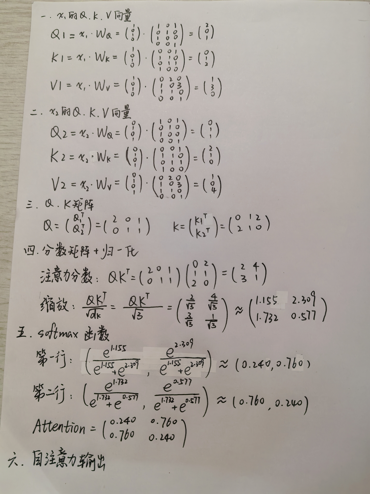
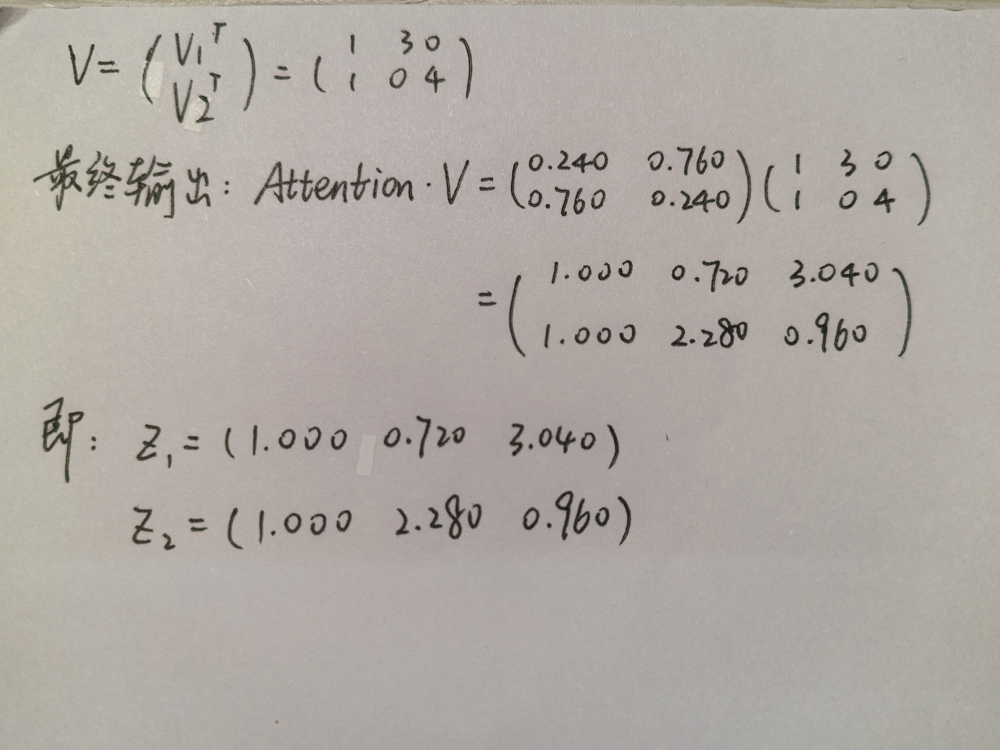

# Transformer —— "Attention Is All You Need" 论文精读与实践
## 任务一：理论问答
1. **在Transformer出现之前，主流的序列模型（如 RNN, LSTM等）存在什么关键的局限性？**
* 顺序依赖、难以并行化：RNN需要按时间步顺序处理序列。这种固有的顺序性导致训练速度慢，尤其是在处理长序列时。
* 长程依赖：处理非常长的序列时，信息在长距离传递中会逐渐衰减或丢失。模型难以记住序列开头的重要信息。
2. **什么是注意力机制？Transformer架构是如何仅通过注意力机制来解决上述局限性的？**
* 注意力机制是一种模拟人类认知中“关注重点”的机制。核心思想：模型可以根据相关性为不同元素分配不同的权重。重要的元素获得高权重，对当前输出的贡献更大。
* a. 解决并行化问题：Transformer摒弃了循环结构，注意力机制允许模型同时处理序列中的所有位置。对于序列中的每一个词，它都可以直接与所有其他词进行计算，从而实现了完全的并行化，极大地加快了训练速度。
b. 解决长程依赖问题：在自注意力中，任意两个位置的交互都是直接的，只需要一次矩阵运算。这意味着序列开头和结尾的词可以直接建立联系，彻底解决了长程依赖问题。
c.解决信息瓶颈：每个词的表示都是通过“关注”所有其他词的表示并加权求和得到的，而不是被压缩到一个固定的隐藏状态中。这为模型提供了更丰富、更全局的上下文信息。
3. **请描述论文中提出的缩放点积注意力（Scaled Dot-Product Attention）的计算全过程。公式： $$Attention(Q,K,V)=softmax(\frac{QK^T}{\sqrt{d_k}})V$$ 中的 Q, K, V 分别代表什么？为什么需要除以 $\sqrt{d_k}$ 进行缩放？**
* 过程：输入后，先对每一个query和key的转置做点积，然后把它作为相似度（点积值越大，两个向量的相似度越高，点积为0，两向量正交，没有相似度），再除以向量的长度进行缩放，再通过对每一行使用softmax转化为概率分布，得到权重
* Q:query，代表当前的需求和意图
* K:key，资料的核心标识
* V:value，最终想获取的实质信息
* 除以 $\sqrt{d_k}$ 缩放原因：$d_k$是向量的长度，即模长，当$d_k$较大时，点积的值也会比较大，从而导致相对差距变大，再经过sofftmax后，最大的值会更靠近于1，而其他值会更加靠近于0，从而导致最后计算的梯度较小，可能导致梯度消失，除以$\sqrt{d_k}$可以将点积的数值控制在一个合理的范围内，确保softmax函数处在梯度敏感的区域，且防止点积过大（可以看做向量标准化？）
4. **什么是多头注意力机制（Multi-Head Attention）？它相比于只使用单个注意力机制有什么优势？论文中是如何将多个头的输出结果合并的？**
* 多头注意力机制是将缩放点积注意力过程并行地执行多次
方法：将输入的Q, K, V通过不同的线性投影层，分别投影到h个不同的、维度更小的子空间。再在每个子空间上独立地执行缩放点积注意力计算，再将h个头得到的输出矩阵拼接起来。最后再通过一个线性投影层，将拼接后的矩阵映射回期望的输出维度。
* 优势：a.不同的头可以学习到不同的注意力模式。
b.将注意力机制在多个不同的投影子空间中运行，为模型提供了更强大的联合表征能力
* 合并方法:拼接。将所有头的输出矩阵在特征维度上拼接起来，然后通过一个可学习的权重矩阵$W^O$进行线性变换，得到最终的输出。
5. **请简要描述位置编码（Positional Encoding）的原理和必要性，并解释为什么选择使用正弦和余弦函数。**
* 原理：位置编码是一个与词嵌入维度相同的向量，它直接与词的嵌入向量相加，作为Encoder和Decoder的输入。使得模型在处理每个词时，能同时获得词的语义信息和位置信息。
* 必要性：自注意力机制中，打乱输入序列的顺序，输出的集合不变，只是顺序被打乱。因此，必须向模型注入关于词汇在序列中位置的信息。
* 选用正余弦函数原因：
6. **简述Transformer的Encoder和Decoder各自的结构和功能。**
* encoder：
a.结构： 由N个相同的层堆叠而成，每一层包含两个子层：多头自注意力机制和前馈神经网络，每个子层周围都有一个残差连接，后接层归一化。
b.功能：处理输入序列，将其转换为一个包含上下文信息的中间表示或记忆，即捕获输入序列中的元素及其复杂关系。
* decoder：
a.结构：由N个完全相同的层堆叠而成，每一层包含三个子层：带掩码的多头自注意力机制，多头注意力机制和前馈神经网络。且每个子层都有残差连接和层归一化。
b.功能：以自回归的方式工作，根据之前生成的输出词和编码器提供的输入序列表示，生成下一个输出词。
7. **Decoder中同时存在多头掩码注意力机制（Masked Multi-Head Attention）和不带掩码的多头注意力机制，它们有什么区别？为什么Decoder需要两种注意力机制？**
* 带掩码：在进行t时刻的计算时，使t时刻以后的输入在参数更新时不起效果
* 不带掩码：可以看到全部的输入
* 原因：为了保证训练与预测时的行为一致，防止信息泄露，保证自回归生成的有效性。
## 任务二：数学推导
解答（手写）：

